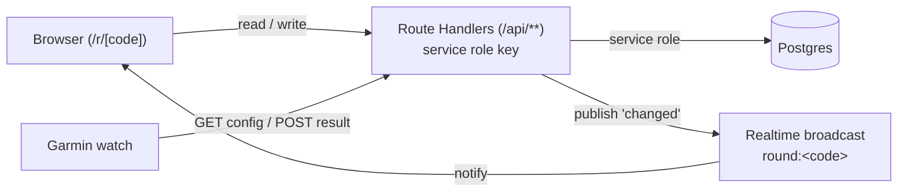

# On-Course Golf Games

Tracks side games during a golf round — nearest to the pin, hole winner, fewest
putts and the like. A flight picks its games before teeing off; anyone with the
round code can enter results from a phone, and later from a Garmin watch.

## Project structure

| Directory | Contents |
|---|---|
| `src/app` | Next.js App Router — pages under `/`, `/setup`, `/r/[code]`, `/admin`, and the HTTP API under `/api`. |
| `src/components` | Presentational React components shared between screens. |
| `src/lib` | Framework-free logic and types usable from both client and server. |
| `src/server` | Server-only modules. Everything that touches the database lives here. |
| `supabase` | Database migrations and local development config. |
| `tests` | Vitest unit and integration tests, mirroring `src`. |
| `e2e` | Playwright end-to-end tests. |
| `docs/superpowers` | Design spec and implementation plan. |

## Architecture: no anonymous database access

Row-level security is enabled on every table and no policies grant anything to
it — anonymous clients (the browser, the watch) have **no** direct database
access at all. Every read and write goes through a Next.js Route Handler under
`src/app/api`, which uses the Supabase service role key to talk to Postgres.
The round code is the credential: knowing it is what lets a request read or
write that round's data, and the server enforces that check itself rather than
relying on RLS.

Liveness comes from a Supabase Realtime *broadcast* channel named
`round:<code>`. After a write, the server publishes a `changed` event on that
channel; every browser open on the round is subscribed to it and refetches the
round's state when it fires.



## Running locally

```bash
npm install
npx supabase start
cp .env.example .env.local   # fill in from `npx supabase status`
npm run dev
```

Set `ADMIN_PASSWORD` in `.env.local`; `/admin` and round creation need it.

The Supabase CLI is a devDependency, not a global install — always run it as
`npx supabase ...` (or via the `npm run supabase:*` scripts below).

To reset the local database to a clean state from the migrations:

```bash
npm run supabase:reset
```

## Testing

```bash
npm test      # Vitest — needs a running local Supabase (npx supabase start)
npm run e2e   # Playwright — starts (or reuses) the dev server itself
```

## Watch API

The Garmin Connect IQ app talks to two endpoints:

- `GET /api/w/:code` — round configuration, fetched once and cached.
- `POST /api/w/:code/result` — `{rc, hole, ranks}`, returns `{ok, standings}`.

Re-sending the same entry corrects it rather than duplicating it, so the watch
can retry freely after a dropped connection.

## Deployment

### 1. Create the Supabase project and push the schema

```bash
npx supabase projects create on-course-golf-games
npx supabase link --project-ref <ref from the dashboard>
npx supabase db push
```

### 2. Deploy to Vercel

```bash
npx vercel link
npx vercel env add NEXT_PUBLIC_SUPABASE_URL production
npx vercel env add NEXT_PUBLIC_SUPABASE_ANON_KEY production
npx vercel env add SUPABASE_SERVICE_ROLE_KEY production
npx vercel env add ADMIN_PASSWORD production
npx vercel --prod
```

Use a long random string for `ADMIN_PASSWORD`. `SUPABASE_SERVICE_ROLE_KEY` must
NOT be prefixed `NEXT_PUBLIC_`.

### 3. Smoke-test production

Open the deployed URL, unlock `/admin` with the production password, add a
player and a challenge, start a round, enter a result, and confirm it appears
on a second device.
